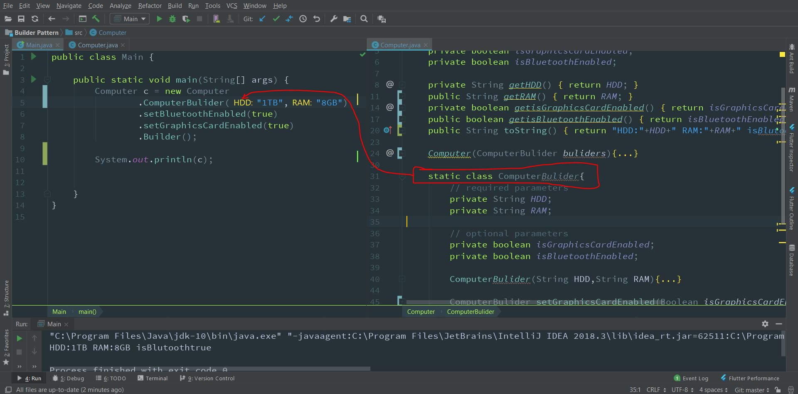

# Builder-Pattern
Builder pattern was introduced to solve some of the problems with Factory and Abstract Factory design patterns when the Object contains a lot of attributes.

There are three major issues with Factory and Abstract Factory design patterns when the Object contains a lot of attributes.

- Too Many arguments to pass from client program to the Factory class that can be error prone because most of the time, the type of arguments are same and from client side its hard to maintain the order of the argument.
- Some of the parameters might be optional but in Factory pattern, we are forced to send all the parameters and optional parameters need to send as NULL.
- If the object is heavy and its creation is complex, then all that complexity will be part of Factory classes that is confusing.  

We can solve the issues with large number of parameters by providing a constructor with required parameters and then different setter methods to set the optional parameters. The problem with this approach is that the Object state will be inconsistent until unless all the attributes are set explicitly.

Builder pattern solves the issue with large number of optional parameters and inconsistent state by providing a way to build the object step-by-step and provide a method that will actually return the final Object.

### Screenshot of the Full code 


Builder Design Pattern in Java
Let’s see how we can implement builder design pattern in java.

- First of all you need to create a static nested class and then copy all the arguments from the outer class to the Builder class. We should follow the naming convention and if the class name is Computer then builder class should be named as ComputerBuilder.
- Java Builder class should have a public constructor with all the required attributes as parameters.
- Java Builder class should have methods to set the optional parameters and it should return the same Builder object after setting the optional attribute.
- The final step is to provide a build() method in the builder class that will return the Object needed by client program. For this we need to have a private constructor in the Class with Builder class as argument.

 ```   
class Computer {
	
	//required parameters
	private String HDD;
	private String RAM;
	
	//optional parameters
	private boolean isGraphicsCardEnabled;
	private boolean isBluetoothEnabled;
	

	public String getHDD() {
		return HDD;
	}

	public String getRAM() {
		return RAM;
	}

	public boolean isGraphicsCardEnabled() {
		return isGraphicsCardEnabled;
	}

	public boolean isBluetoothEnabled() {
		return isBluetoothEnabled;
	}
	
	private Computer(ComputerBuilder builder) {
		this.HDD=builder.HDD;
		this.RAM=builder.RAM;
		this.isGraphicsCardEnabled=builder.isGraphicsCardEnabled;
		this.isBluetoothEnabled=builder.isBluetoothEnabled;
	}
	
	//Builder Class
	public static class ComputerBuilder{

		// required parameters
		private String HDD;
		private String RAM;

		// optional parameters
		private boolean isGraphicsCardEnabled;
		private boolean isBluetoothEnabled;
		
		public ComputerBuilder(String hdd, String ram){
			this.HDD=hdd;
			this.RAM=ram;
		}

		public ComputerBuilder setGraphicsCardEnabled(boolean isGraphicsCardEnabled) {
			this.isGraphicsCardEnabled = isGraphicsCardEnabled;
			return this;
		}

		public ComputerBuilder setBluetoothEnabled(boolean isBluetoothEnabled) {
			this.isBluetoothEnabled = isBluetoothEnabled;
			return this;
		}
		
		public Computer build(){
			return new Computer(this);
		}

	}

}
```
  
